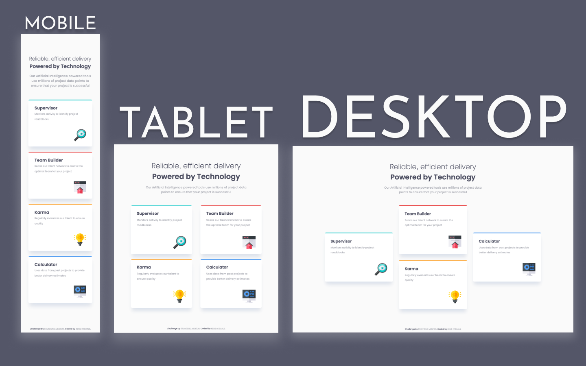

# Frontend Mentor - Four Card Feature Section Solution

This is a solution to the [Four Card Feature Section Challenge on Frontend Mentor](https://www.frontendmentor.io/challenges/four-card-feature-section-weK1eFYK).

## Table of contents

- [Overview](#overview)
  - [The challenge](#the-challenge)
  - [Screenshot](#screenshot)
  - [Links](#links)
- [My process](#my-process)
  - [Built with](#built-with)
  - [Continued development](#continued-development)
  - [Useful resources](#useful-resources)
- [Author](#author)

## Overview

### The challenge

Users should be able to:

- View the optimal layout for the site depending on their device's screen size

### Screenshot

### Links

- Solution URL: [https://www.frontendmentor.io/solutions/four-card-feature-section-with-bem-and-scss-YfhlZvokE](https://www.frontendmentor.io/solutions/four-card-feature-section-with-bem-and-scss-YfhlZvokE)
- Live Site URL: [https://kens-visuals.github.io/four-card-feature-section/](https://kens-visuals.github.io/four-card-feature-section/)

## My process

### Built with

- Semantic HTML5 markup
- SCSS custom properties
- CSS Flexbox
- CSS Grid
- Mobile-first workflow

### Continued development

I've had a lot of fun building this project, here is why. I've wanted to work on a project that will allow me to use both CSS Flexbox and CSS Grid at the same time, that will fit to the needs of the project harmonically. This project was the perfect candidate to achieve what I've wanted to do for a while. Moreover, this was a perfect project to use BEM convention. There are a lot of pieces that are technically the same, so BEM helped me to use its power to shorten my CSS, and of course BEM + SCSS makes both of them even more powerful.

### Useful resources

- [Box Shadow Collection](https://getcssscan.com/css-box-shadow-examples) - This is a really good collection of various CSS box-shadows by CSS Scan, which helped me to achieve some cool hover effects.

## Author

- Frontend Mentor - [@kens-visuals](https://www.frontendmentor.io/profile/kens-visuals)
- Codewars - [@kens_visuals](https://www.codewars.com/users/kens_visuals)
- CodePen - [@kens-visuals](https://codepen.io/kens-visuals)
